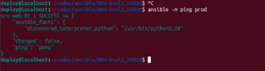
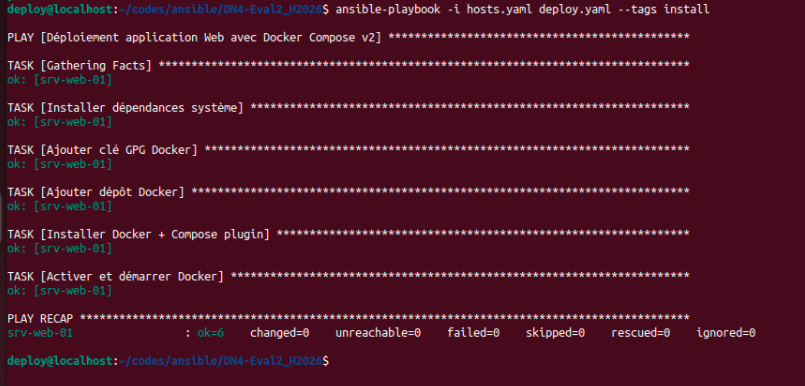
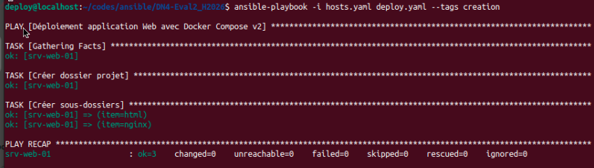
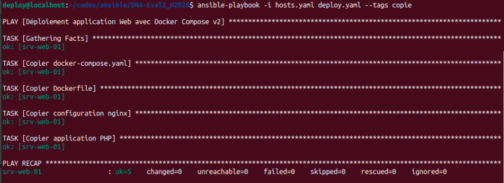
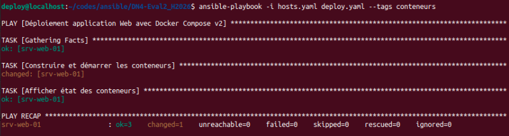
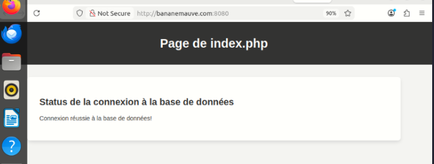
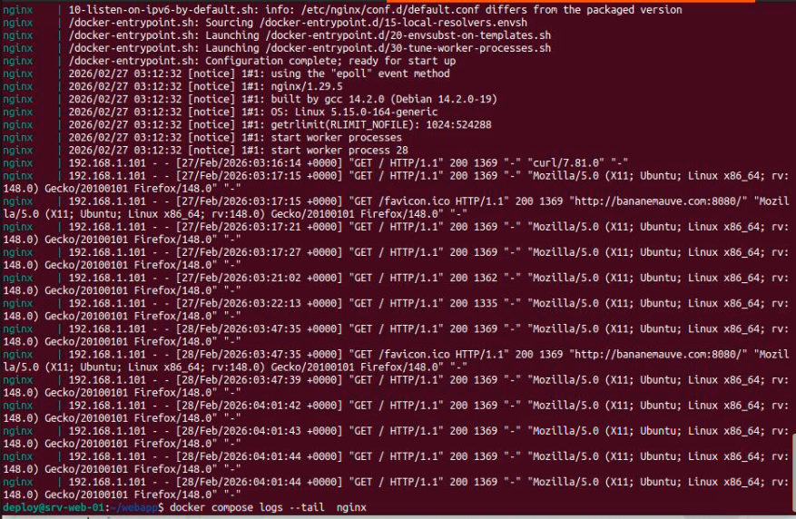

 

# Evaluation 2

| Sécurisation d'un parc informatique -- AEC (LEADN)    |
| :---                                                  |
| Sécurisation des appareils 420-DN4-SF                           |
| Hiver 2026     |

## 1- Une capture d'écran d'un ping (avec Ansible) aux appareils de prod-

**Capture ping appareils prod**

## 2- Une capture d'écran de l'installation de Docker

 

**Capture de l'installation de Docker.**

## 3- Une capture d'écran de la création de répertoires/dossiers

**Capture du création des dossiers sur la VM.**

## 4- Une capture d'écran de la copie de vos fichiers vers la machine distante

**Capture du ccopie des fichiers vers la VM.**

## 5- Une capture d'écran du lancement des conteneurs

 

**Capture Lancement des conteneurs.**

## 6- Une capture d'écran de votre navigateur affichant le site Web avec la connexion à la BD

 

**Capture du navigateur.**

## 7- Une capture d'écran de votre navigateur affichant le site Web avec la connexion à la BD

 

**Capture Journaux du serveu Web.**

## Références :

[Déploiement d'Ansible sur le système d'exploitation Ubuntu](https://labex.io/fr/tutorials/ansible-deploying-ansible-on-ubuntu-operating-system-411632)

[Comprendre l’inventaire Ansible](https://linux.goffinet.org/ansible/comprendre-inventaire-ansible/)

[Building a Complete PHP Stack Using Docker and Docker-Compose](https://www.centron.de/en/tutorial/deploy-a-php-app-with-nginx-mysql-docker-compose/)

[A system administrator's guide to getting started with Ansible - FAST!](https://www.redhat.com/en/blog/system-administrators-guide-getting-started-ansible-fast) 

[Documentation officielle d'Ansible](https://docs.ansible.com)  

[Documentation ansible pour group_vars](https://docs.ansible.com/ansible/latest/inventory_guide/intro_inventory.html#organizing-host-and-group-variables) 

[Documentation ansible pour import_playbook](https://docs.ansible.com/ansible/latest/collections/ansible/builtin/import_playbook_module.html)  

[Documentation ansible pour copy](https://docs.ansible.com/ansible/latest/collections/ansible/builtin/copy_module.html)  

[Documentation ansible pour file](https://docs.ansible.com/ansible/latest/collections/ansible/builtin/file_module.html#file-module) 

[Documentation officielle de Docker](https://docs.docker.com)  

[Documentation de Community.Docker](https://docs.ansible.com/ansible/latest/collections/community/docker/index.html#description)  

[How to run docker-compose commands with ansible?](https://stackoverflow.com/questions/62452039/how-to-run-docker-compose-commands-with-ansible#62452959)  

[Documentation pour une adresse statique sur un serveur Ubuntu 22.04](https://www.linuxtechi.com/static-ip-address-on-ubuntu-server/)  
