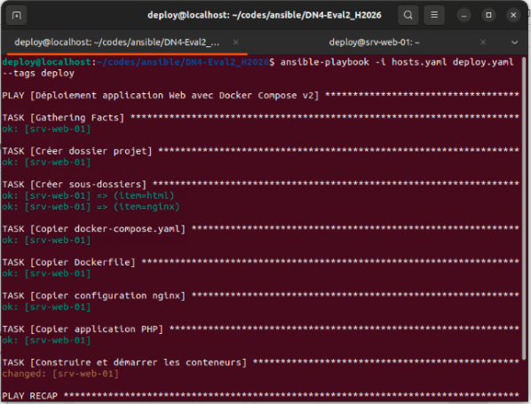
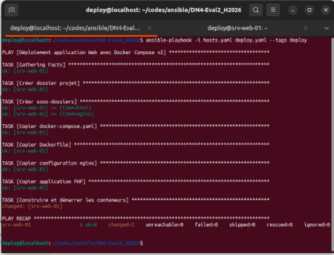

## Une capture d'écran d'un ping (avec Ansible) aux appareils de prod

**CCapture ping appareils prod**

## Une capture d'écran de l'installation de Docker

 

**Capture de l'installation de Docker.**

## Une capture d'écran de la création de répertoires/dossiers

**Capture du création des dossiers sur la VM.**

## Une capture d'écran de la copie de vos fichiers vers la machine distante

## Une capture d'écran du lancement des conteneurs

 

**Capture Lancement des conteneurs.**

## Une capture d'écran de votre navigateur affichant le site Web avec la connexion à la BD

 

**Capture du navigateur.**

## Une capture d'écran des journaux (logs) de votre serveur Web

